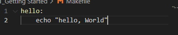
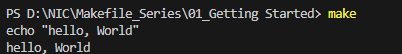
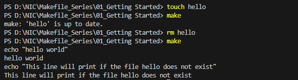

# Getting Started

## Why do Makefiles exist?
Makefiles are used to help decide which parts of a large program need to be recompiled. In the vast majority of cases, C or C++ files are compiled. Other languages typically have their own tools that serve a similar purpose as Make. Make can also be used beyond compilation too, When you need a series of instructions to run depending on what files have changed. This tutorial will focus on the C/C++ compilation use case.

## What alternatives are there to Make?
Popular C/C++ alternative build systems are Scons, CMake, Bazel and Ninja. Some code editors like Microsoft Visual Studio have their own built in build tools. For Java, there's Ant, Maven and Gradle. Other languages like GO, Rust adn TypeScript have their own build tools.
Interpreted languages lile Python, Ruby and raw JavaScript dont require an analogue to Makefiles. The goal of Makefiles is to compile whatever files need to be compiled, based on what files have changed. But when files in interpreted languages change, nothing needs to get recompiled. When the program runs, the most recent version of the file is used.

## The versions and types of Make
There are a variety of implementations of Make, but most of this guide will work on whatever version you're using. However, It's specifically written for GNU Make, which is the standard implementation on Linux and MacOS. All the examples work for Make verions 3 and 4, Which are nearly equivalent other than some esoteric differences.

## Running the Examples 
To run these examples, you'll need a terminal and "make" installed. For each example, put the contents in a file called Makefile, and in the directory run the command make. Let's start with the simplest of Makefiles.

Note: Makefiles must be indented using TABs and not spaces or Make will fail.
Here is the output of running the above example"

## Makefile Syntax
A Makefile consists of a set of rules. A rule generally looks like this:
    targets: prerequisites
        command
        command
        command
- The targets are file names, separated by spaces. Typically, there is only one per rule.
- The commands are a series of steps typically used to make the target(s). These need to start with a tab character, not spaces.
- The prerequisites are also file names, separated by spaces. These files need to exist before the commands for the target are run. These are also called dependencies.

## The essence of Make
Let's start with a hello world example:
    hello:
        echo "hello world"
        echo "This line will print if the file hello does not exist"

There's already a lot to take in here. Let's break it down:
- We have one target called hello
- This target has two commands
- This target has no prerequisites

We'll then run make hello. As logn as the hello file does not exist, the commands will run. If hello does exist, no commands will run.
It's important to realize that I'm talking about hello as both a target and a file. That's because the two are directly tied together.
Typically, when a target is run (aka when the commands of a target are run), the commands will create a file with the same name as the target. In this case, the hello target does not create the hello file.