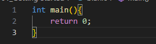
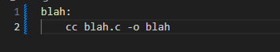
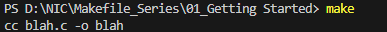
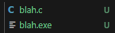
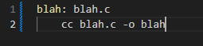
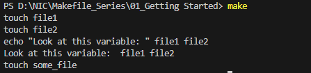

# Getting Started

## Why do Makefiles exist?
Makefiles are used to help decide which parts of a large program need to be recompiled. In the vast majority of cases, C or C++ files are compiled. Other languages typically have their own tools that serve a similar purpose as Make. Make can also be used beyond compilation too, When you need a series of instructions to run depending on what files have changed. This tutorial will focus on the C/C++ compilation use case.

## What alternatives are there to Make?
Popular C/C++ alternative build systems are Scons, CMake, Bazel and Ninja. Some code editors like Microsoft Visual Studio have their own built in build tools. For Java, there's Ant, Maven and Gradle. Other languages like GO, Rust adn TypeScript have their own build tools.
Interpreted languages lile Python, Ruby and raw JavaScript dont require an analogue to Makefiles. The goal of Makefiles is to compile whatever files need to be compiled, based on what files have changed. But when files in interpreted languages change, nothing needs to get recompiled. When the program runs, the most recent version of the file is used.

## The versions and types of Make
There are a variety of implementations of Make, but most of this guide will work on whatever version you're using. However, It's specifically written for GNU Make, which is the standard implementation on Linux and MacOS. All the examples work for Make verions 3 and 4, Which are nearly equivalent other than some esoteric differences.

## Running the Examples 
To run these examples, you'll need a terminal and "make" installed. For each example, put the contents in a file called Makefile, and in the directory run the command make. Let's start with the simplest of Makefiles.

Note: Makefiles must be indented using TABs and not spaces or Make will fail.
Here is the output of running the above example"

## Makefile Syntax
A Makefile consists of a set of rules. A rule generally looks like this:
    targets: prerequisites
        command
        command
        command
- The targets are file names, separated by spaces. Typically, there is only one per rule.
- The commands are a series of steps typically used to make the target(s). These need to start with a tab character, not spaces.
- The prerequisites are also file names, separated by spaces. These files need to exist before the commands for the target are run. These are also called dependencies.

## The essence of Make
Let's start with a hello world example:
    hello:
        echo "hello world"
        echo "This line will print if the file hello does not exist"

There's already a lot to take in here. Let's break it down:
- We have one target called hello
- This target has two commands
- This target has no prerequisites

We'll then run make hello. As long as the hello file does not exist, the commands will run. If hello does exist, no commands will run.
It's important to realize that I'm talking about hello as both a target and a file. That's because the two are directly tied together.
Typically, when a target is run (aka when the commands of a target are run), the commands will create a file with the same name as the target. In this case, the hello target does not create the hello file.

Let's create a more typical Makefile - one that compiles a single C file. But before we do, make a file called blah.c that has the following contents:

    // blah.C   

Then create the Makefile (called Makefile, as always):

After use make command. This create new file .exe

This time, try simply running make. Since there's no target supplied as argument to the make command, the first target is run. In this case, there's only one target (blah). The first time you run this, blah will be created. The second time, you'll see make: 'blah' is up to date. That's because the blah file already exists. But there's a problem. If we modify blah.c and then run make, nothing gets recompiled.

We solve this by adding a prerequisite:

When we run make again, the following set of steps happens:
    - The fist target is selected, because the first target is the default target
    - This has a prerequisite of blah.c
    - Make decides if it should run the blah target. It will only run if blah doesn't exist, or blah.c is newer than blah.

This last step is critical, and is the essence of make. What it's attempting to do is decide if the prerequisites of blah have changed since blah was last compiled. That is, if blah.c is modified, running make should recompile the file. And converserly, if blah.c has not changed, than it should not be recompiled.

To make this happen, it uses the filesystem timestamps as a proxy to determine if something has changed. This is a reasonable heuristic, because file timestamps typically will only change the modified timestamp of that file to something old. If you did, Make would incorrectly guess that the file hadn't changed and thus could be ignored.

Whew, what a mouthful. Make sure that you understand this. It's the crux of Makefiles, and mighr take you a minutes to properly understand. Play around with abouve examples or watch the video above if things are still confusing.

## More quick examples
The following Makefile ultimately runs all three targets. When you run make in the terminal, It will build a program called blah in a series of steps:
    - Make selects the target blah, because the first target is the default target
    - blah requires blah.o, so make searches for the blah.o target
    - blah.o requires balh.c, so make searches for the blah.c target
    - blah.c has no dependencies, so the echo command is run.
    - The cc -c command is then run, because all of the blah.o dependencies are finished.
    The top cc command is run, because all the blah dependecies are finished.
    That's it: blah is a compiled c program

blah: blah.o
    cc blah.o -o blah
blah.o : blah.c
    cc -c blah.c -o blah.o # Runs second
    #Typically blah.c would already exist, but I want to limit any additional required files
blah.c:
    echo "int main() {return 0; }" > blah.c # Runs first

If you delete blah.c, all three targets will be rerun. If you edit it( and thus change the timestamp to newer than blah.o), the first two targets will run, if you run touch blah.o (and thus change the timestamp to newer than blah), then only the first target will run. If you change nothing, none of the targets will run. Try it out!

This next example doesn't do anything new, but is nontheless a good additional example. It will always run both targets, because some_file depends on other_file, which is never created.

some_file: other_file
    echo "This will always run, and runs second"
    touch some_file
other_file:
    echo "This will always run, and runs first"

Make clean
    clean such as target. It often removes the output of other targets, but it is not a special word in Make. Run make to create some_file and run make clean to delete some_file.
Note that clean is doing two new things here:
    - It's a target that is not first (the default), and not a prerequisite. That means it'll never run unless you explicitly call make clean
    - It's not intended to be a filename. If you happen to have a file named clean, this target won't run, which is not what we want. See .PHONY later in this tutorial on how to fix this.

some_file:
    touch some_file
clean:
    rm -f some_file
Variables
Variables can only be strings. You'll typically want to use :=, but = also work. See Variables Pt 2.
Here's an example of using variables:

files := file1 file2
some_file: $(files)
    echo "Look at this variable:  " $(files)
    touch some_file
file1:
    touch file1
file2:
    touch file2

clean:
    rm -f file1 file2 some_file

**Result**

Single or double quotes have no meaning to Make. They are simply characters that are assigned to the variable. Quotes are usefull to shell/bash, though, and you need them in commands like printf. In this example, the two commands behave the same:
