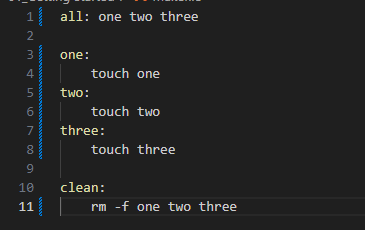
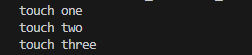
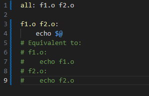
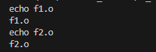

## Targets
**The all targer**

Make multiple targets and you want all of them to run? Make an all target. Since this is the first rule listed, it will run by default if make is called without specifying a target.

Result:

**Multiple targets**

When there are multiple targets for a rule, the commands will be run for each target. $@ is an automatic variable that contains the target name.

Result:

