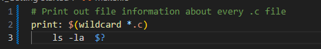
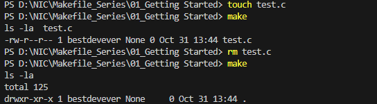
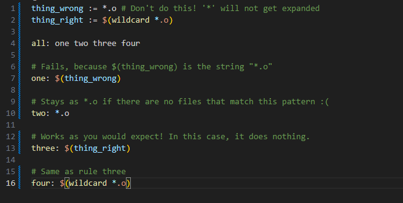
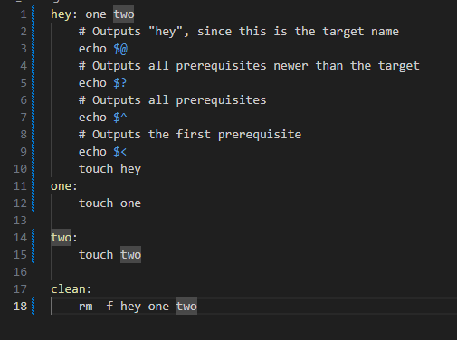
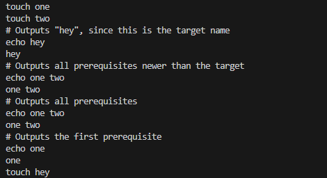

## Automatic Variables and Wildcards

**Wildcard**

Both * and % are called wildcards in Make, but they mean entirely different things things. * searches your filesytem for matching filenames. I suggest that you always wrap it in the wildcard function, because otherwise you may fall into a common pitfall described below.

For example, if your folder doest not contain any .c files, it will display all files in your folder. If there is at least one .c file, it will display only that .c file.
it will execute ls -la command without $?

* may be used in the target, prerequisites, or in the wildcard function.

Danger: * may not be directly used in a variable definitions
Danger: When * matches no files, it is left as it is (unless run in the wildcard function)

**%Wildcard**

% is really useful, but is somewhat confusing because of the variety of situations it can be used in.
- When used in "matching" mode, it matches one or more characters in a string. This match is called the stem.
- % is most often used in rule definitions and in some specific functions.

See these sections on examples of it being used:
- Static Pattern Rules
- Pattern Rules
- String Substitution
- The vpath Directive

**Automatic Variables**
There are many automatic variables, but often only a few show up:

