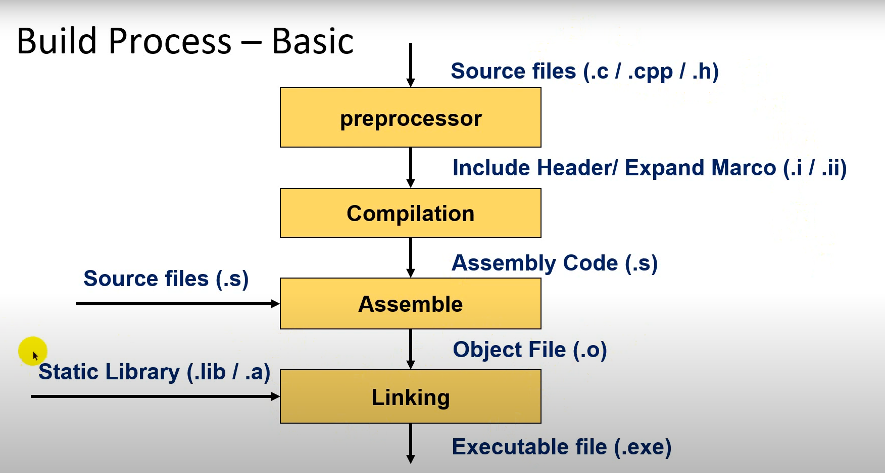
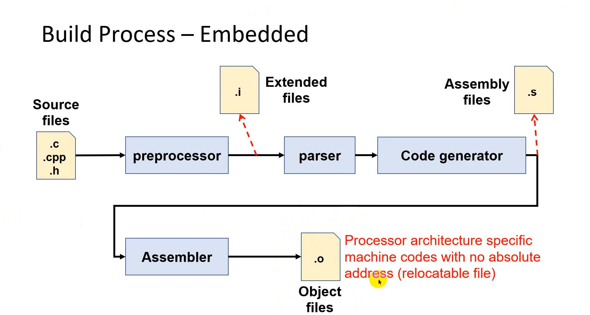
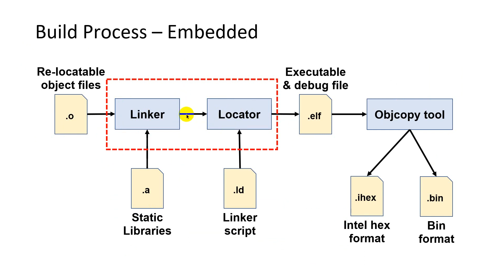

# Introduction
The repo is intended for learning how to use makefile. It is based on a [makefile toturial ](https://makefiletutorial.com/).

Compile C in PC

Describe the compile processor from .c files to .exe file:
- Writting code: Begin by writting your code in a text editor and save it with file name .c(example program.c)
- Preprocessor: The compiler's Preprocessor reads the .c file and processes any preprocessor directives (like #include and #define). It generates an expanded source file that is ready for compilation.
- Compilation: In this stage, the compiler translates the preprocessed C code into assembly language, creating an assembly file (with a .s extension).
- mAssembly: The assembler takes the assembly code file and converts it into machine code, creating an object file with a .o or .obj extension.
- Linking: The linker combines the object file with any libraries or additional code files and resolves references. This produces an executable file, typically with a .exe extension on Windows.
- Executable (.exe): The final output is the .exe file, which can be run as a standalone application.

**Date:** 21 october, 2024
